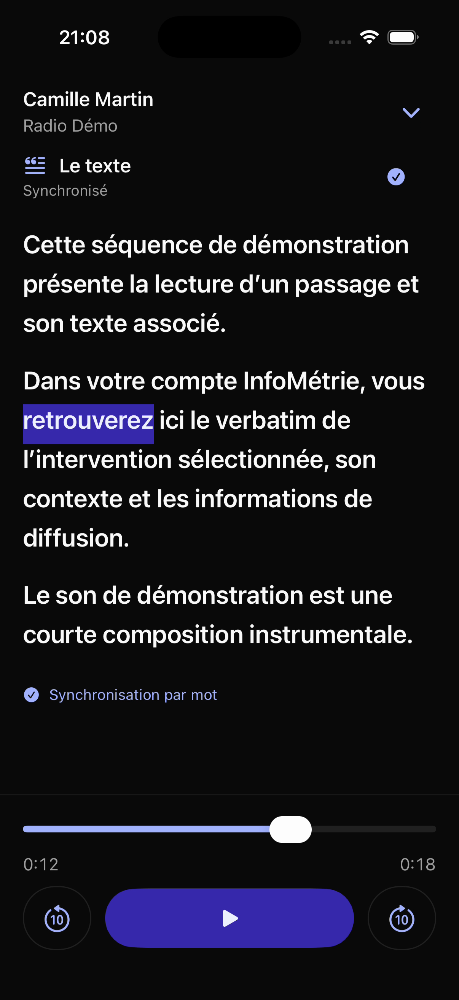
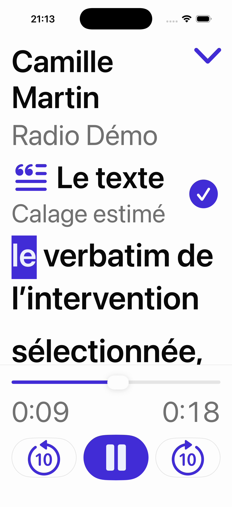

# Texte d’une séquence en plein écran

Le bouton d’agrandissement, à droite de « Le texte », ouvre une présentation de lecture qui occupe tout l’écran sur iPhone et iPad. La personne et le média restent identifiables en haut ; le lecteur reste accessible en bas. Le chevron permet de revenir à la fiche.

Le texte utilise une police système plus grande, des paragraphes espacés et une mise en évidence indigo du mot courant. Il conserve les tailles Dynamic Type et le réglage S / M / L. Le lecteur utilise des commandes iconographiques avec des libellés accessibles pour conserver de la place pour le texte, y compris aux grandes tailles.

## Comportement

- Ouvrir ou réduire le texte ne démarre, ne redémarre et n’interrompt pas l’écoute.
- La vue utilise le même `PlaybackModel`, le même `AVPlayer`, les mêmes horodatages et le même calcul de correspondance mot / instant que la fiche.
- Toucher un mot déplace l’écoute à cet instant. Si aucun lecteur n’est actif pour cette séquence, il démarre à partir de ce mot. Si le lecteur est en pause, il reste en pause.
- Le curseur et les sauts de dix secondes mettent à jour le surlignage ; lecture, pause et réécoute restent disponibles.
- Le défilement manuel suspend le suivi. Le bouton de suivi le réactive. Ce choix et le repère de défilement sont partagés avec la fiche.
- La fermeture du plein écran conserve la position et l’état de lecture. Quitter la fiche arrête toujours son lecteur, comme auparavant.
- La mention de calage estimé est conservée lorsque les horodatages précis ne sont pas disponibles. Les informations détaillées de synchronisation et les erreurs audio restent accessibles sous le texte ; un message concernant le mot demandé s’affiche au-dessus du texte pour rester visible.
- La fiche sous-jacente est masquée aux technologies d’assistance pendant l’affichage plein écran ; le geste d’échappement VoiceOver réduit le texte.
- Les publications X conservent leur présentation sans lecteur audio.

Périmètre : fiches de séquence. La présentation de la file « Tout écouter » conserve son comportement actuel.

## Aperçus

Les captures ci-dessous montrent le texte agrandi en thème sombre, puis les commandes au réglage système de grande taille.

