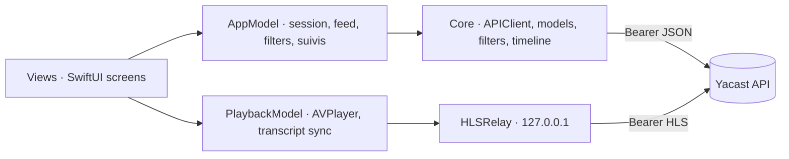

# Architecture

The macro technical shape: the stack, how the pieces fit, and the decisions behind them. Point to the code, do not restate it.

## Stack

- Swift 6 with strict concurrency (`SWIFT_STRICT_CONCURRENCY = complete`), SwiftUI and Observation (`@Observable` models on the main actor).
- Apple frameworks only: URLSession, AVFoundation, Network, Security. No third-party runtime dependency, by decision.
- Xcode project for the app, plus a Swift package (`Package.swift`, product `InfometrieCore`) that compiles `Infometrie/Core` alone on macOS for `swift test`.

## How it fits together

## Key decisions

- `Infometrie/Core` imports `Foundation` only, so it builds in the macOS test package. UIKit, SwiftUI, AVFoundation and Keychain code belongs in `Services` or `Views`.
- AVPlayer cannot send a Bearer header, so media goes through a loopback relay (`Infometrie/Services/HLSRelay.swift`). It authenticates with URLSession, rewrites manifest links, refuses any URL or redirect outside the API origin so the token never leaks, writes nothing to disk, and uses a random route per playback session.
- Because of the loopback relay, AirPlay / external playback is disabled, and playback pauses when the app leaves the foreground, like the APK.
- Every URLSession uses `SameOriginRedirectDelegate`, ephemeral configuration and no URL cache.
- Kinds are filtered by the server (`kinds`) and checked again locally (`SearchFilters.accepts`). Any filter change restarts from `since_seq=0`, and a response from an older request never replaces the current selection (`requestID`).
- Word timings are optional: loaded in parallel, never blocking the page or the media. On 404, 502, network error or text mismatch the UI falls back to "Calage estimé" with a retry. 401 and 403 still end the session.
- Word timings are milliseconds from `origin`, not from `speech_start`, mapped to player time through the HLS `EXT-X-PROGRAM-DATE-TIME` clock (`MediaClock` in `Infometrie/Core/TranscriptTimeline.swift`).
- Publications X are never playable (`FeedItem.canPlay`), even when `has_media` says otherwise: no player, no duration, no timings, not in the podcast.
- The Swagger does not describe response bodies. Models come from the APK and decode leniently: defaults for missing fields, unknown fields ignored.
- No demo mode: the app always needs an account. UI tests never touch the network either: a Debug-only local server (`UITestServer` in `Infometrie/Fixtures`) answers the API and HLS routes, so the real API client, relay and Keychain run.

## Gotchas

- The app target uses file-system synchronized groups: a new file under `Infometrie/` joins the app with no `project.pbxproj` edit. A new file under `Infometrie/Core` also joins the macOS package, so it must stay Foundation-only.
- `scripts/create_project.py` must reproduce the committed `project.pbxproj`, scheme, `Info.plist`, asset catalog roots and `AccentColor` byte for byte. Change project settings in the script, or mirror a change made in Xcode there. Afterwards, `python3 scripts/create_project.py && git status --short` must show nothing new.
- `Infometrie/Fixtures` is test-only and must stay out of Release: wrap its Swift in `#if DEBUG`, and name its media `fixture-audio-*.ts`, the pattern Release excludes (`EXCLUDED_SOURCE_FILE_NAMES` in `scripts/create_project.py`).
- Saved searches written before API 0.6 have no `tweets` field. It decodes to `false` on purpose, so an old suivi never silently widens to X.
- The login response `expires` has no documented unit: the client does not check it and lets the server reject a stale token.
