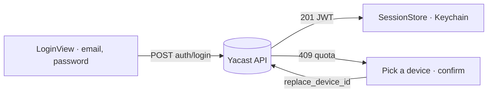

# Auth

How identity and access work: authentication and authorization.

## Authentication

- Email and password posted as JSON to `POST /rest/v1/auth/login` (HTTP 201) with a stable `device_uid`, the device name and model. The answer carries a JWT and the account identity. Wired in `AppModel.login` and `APIClient.login`.
- The email is trimmed and lowercased before sending.

## Authorization

- No roles on the client. The server grants access by subscription. Any 401 or 403 on a private route, word timings included, logs the user out with a message.

## Sessions

- The session and the device id live in the Keychain (`SessionStore`, service `fr.yacast.infometrie.ios`, `WhenUnlockedThisDeviceOnly`). The password is never stored. The last email sits in `UserDefaults`.
- On launch the saved session is restored as is. `expires` has no documented unit, so the server decides.
- Logout is local: it clears the Keychain session and in-memory content, with no server call. The device id survives logout, so the server keeps seeing the same device.
