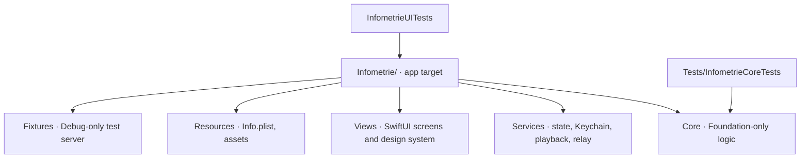

# Codebase Map

The macro layout: the top-level areas and what each holds. A map to navigate, not the full tree.

## Areas

- `Infometrie/Core`: Codable models, `APIClient`, filters and feed merge, saved-search storage, HLS manifest parsing, word-timing alignment.
- `Infometrie/Services`: `AppModel`, `PlaybackModel`, `SessionStore` (Keychain), `HLSRelay`.
- `Infometrie/Fixtures`: Debug-only `UITestServer` (local API and HLS for UI tests), its fictional content and instrumental audio segments.
- `Infometrie/Views`: screens, plus `Design.swift` for tokens and shared components.
- `Infometrie/Resources`: `Info.plist`, `Assets.xcassets` (app icon, `channel-*` logos), `PrivacyInfo.xcprivacy`.
- `Tests/InfometrieCoreTests`: Swift Testing suites for Core, including the Swagger contract.
- `InfometrieUITests`: XCUITest journeys on the simulator.
- `Docs`: APK analysis, API contract and local `openapi.yaml`, dated validation log (`VALIDATION.md`), UX iterations with before/after screenshots.
- `scripts/create_project.py`: one-shot generator of the Xcode project and resources.
- `aidd_docs/tasks`: AIDD plans and debug notes, by month.

## Entry points

- `Infometrie/InfometrieApp.swift`: `@main`, `makeAppModel` (Debug test fixtures), `RootView` with the restore task and the 30-second refresh loop.
- `Infometrie.xcodeproj`, scheme `Infometrie` (app plus UI tests).
- `Package.swift`: the `InfometrieCore` test package.
