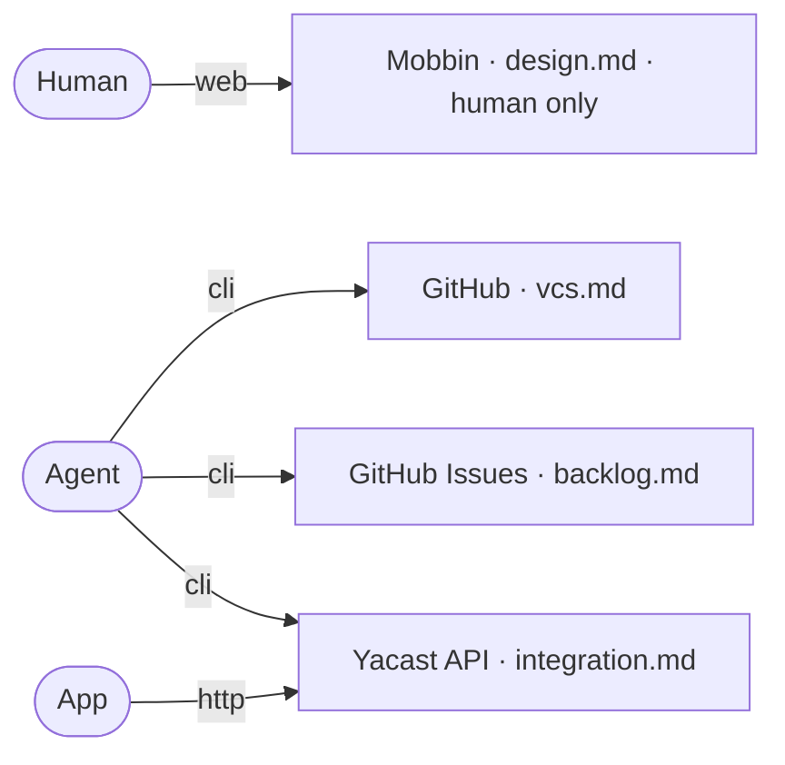

# Ecosystem

```mermaid
flowchart LR
  Human([Human])
  Agent([Agent])
  App([App])
  Vcs["GitHub · vcs.md"]
  Tracker["GitHub Issues · backlog.md"]
  Yacast["Yacast API · integration.md"]
  Mobbin["Mobbin · design.md · human only"]

  Agent -- cli --> Vcs
  Agent -- cli --> Tracker
  Agent -- cli --> Yacast
  App -- http --> Yacast
  Human -- web --> Mobbin
```
