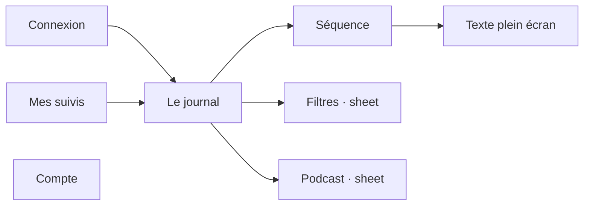

# Navigation

How the user moves through the app: routing and the page structure.

## Routing

- No router. `RootView` in `Infometrie/InfometrieApp.swift` switches between the restore spinner, `LoginView` and the signed-in shell. Everything past login needs `isAuthenticated` (a session).
- The signed-in shell is a `TabView` with three destinations, each in its own `NavigationStack`: Le journal, Mes suivis, Compte. Filtering is an action of the feed, not a fourth destination.
- At regular width (iPad), a custom `MainNavigation` replaces the tab bar: a sidebar, or a horizontal strip at the top at accessibility text sizes.
- Filters open as a sheet (`SearchView`) that edits a `draft`: Cancel keeps the applied filters. The podcast is a sheet bound to `player.isPodcast`, and closing it stops playback.

## Structure

