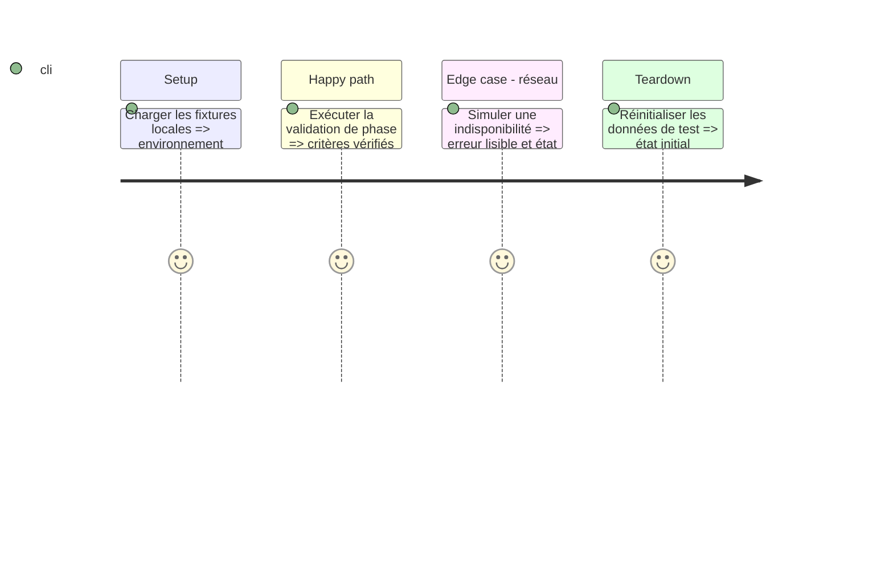

# Instruction: Contrat API, modèles et stockage

## Architecture projection

Créer les fichiers suivants. Aucun fichier existant à modifier ou supprimer.

```txt
Infometrie/Core/ — modèles, filtres et client API
Infometrie/Services/ — session et stockage
Docs/APK-ANALYSIS.md — contrat relevé
```

## User Journey

Connexion et session

## Test Scope



## Tasks to do

### `1)` Relever routes, champs JSON, filtres et comportements dans le DEX.

### `2)` Créer modèles Codable, client HTTP, erreurs et session Keychain.

### `3)` Persister recherches et identifiant appareil ; isoler les données par compte.

## Test acceptance criteria

| Task | Acceptance criteria |
| --- | --- |
| 1 | Les requêtes utilisent les paramètres et champs observés dans l’APK. |
| 2 | Un jeton révoqué termine la session ; une erreur réseau conserve les données affichées. |
| 3 | Les recherches peuvent être créées, archivées, restaurées et supprimées. |
