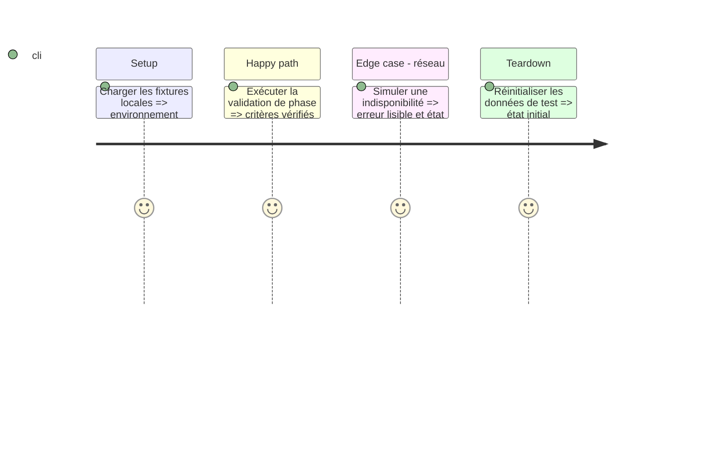

# Instruction: Interface native et lecture

## Architecture projection

Créer les fichiers suivants. Aucun fichier existant à modifier ou supprimer.

```txt
Infometrie/Views/ — connexion, fil, recherche, sauvegardes, compte, séquence, podcast
Infometrie/Services/ — lecteur authentifié
Infometrie/InfometrieApp.swift — racine
Infometrie/Resources/ — ressources
```

## User Journey

Connexion → Fil → Recherche → Séquence ou Podcast

## Test Scope



## Wireframe

Connexion

```txt
┌──────────────────────────────────────────┐
│ (1) Marque et présentation               │
├──────────────────────────────────────────┤
│ (2) Email et mot de passe                │
├──────────────────────────────────────────┤
│ (3) Connexion et démonstration           │
└──────────────────────────────────────────┘
```

1. En-tête et contexte.
2. Contenu principal.
3. Actions ou navigation.

Fil

```txt
┌──────────────────────────────────────────┐
│ (1) Titre et compte                      │
├──────────────────────────────────────────┤
│ (2) Critères et liste des passages       │
├──────────────────────────────────────────┤
│ (3) Navigation et podcast                │
└──────────────────────────────────────────┘
```

1. En-tête et contexte.
2. Contenu principal.
3. Actions ou navigation.

Recherche

```txt
┌──────────────────────────────────────────┐
│ (1) Titre et remise à zéro               │
├──────────────────────────────────────────┤
│ (2) Types, personnes et partis           │
├──────────────────────────────────────────┤
│ (3) Appliquer et sauvegarder             │
└──────────────────────────────────────────┘
```

1. En-tête et contexte.
2. Contenu principal.
3. Actions ou navigation.

Séquence

```txt
┌──────────────────────────────────────────┐
│ (1) Média et commandes                   │
├──────────────────────────────────────────┤
│ (2) Identité, résumé et verbatim         │
├──────────────────────────────────────────┤
│ (3) Navigation des passages              │
└──────────────────────────────────────────┘
```

1. En-tête et contexte.
2. Contenu principal.
3. Actions ou navigation.

Podcast

```txt
┌──────────────────────────────────────────┐
│ (1) Lecture et progression               │
├──────────────────────────────────────────┤
│ (2) Liste des séquences                  │
├──────────────────────────────────────────┤
│ (3) Commandes précédent/suivant          │
└──────────────────────────────────────────┘
```

1. En-tête et contexte.
2. Contenu principal.
3. Actions ou navigation.

Recherches enregistrées

```txt
┌──────────────────────────────────────────┐
│ (1) Titre et nouvelle recherche          │
├──────────────────────────────────────────┤
│ (2) Actives ou archivées                 │
├──────────────────────────────────────────┤
│ (3) Liste et actions                     │
└──────────────────────────────────────────┘
```

1. En-tête et contexte.
2. Contenu principal.
3. Actions ou navigation.

Compte

```txt
┌──────────────────────────────────────────┐
│ (1) Identité du compte                   │
├──────────────────────────────────────────┤
│ (2) Informations et préférences          │
├──────────────────────────────────────────┤
│ (3) Déconnexion                          │
└──────────────────────────────────────────┘
```

1. En-tête et contexte.
2. Contenu principal.
3. Actions ou navigation.


## Tasks to do

### `1)` Construire les écrans SwiftUI avec navigation native, Liquid Glass et Dynamic Type.

### `2)` Brancher filtres, rafraîchissement, enregistrement et actions de compte.

### `3)` Lire les médias authentifiés avec AVPlayer, timeline, précédent/suivant et verbatim.

### `4)` Fournir les états vide, chargement, erreur et démonstration clairement nommée.

## Test acceptance criteria

| Task | Acceptance criteria |
| --- | --- |
| 1 | Les parcours sont navigables sans boutons factices. |
| 2 | Les critères personnalités et partis se combinent par intersection. |
| 3 | La lecture respecte les bornes du passage et affiche les erreurs. |
| 4 | Aucun export ou partage de séquence n’est proposé. |
