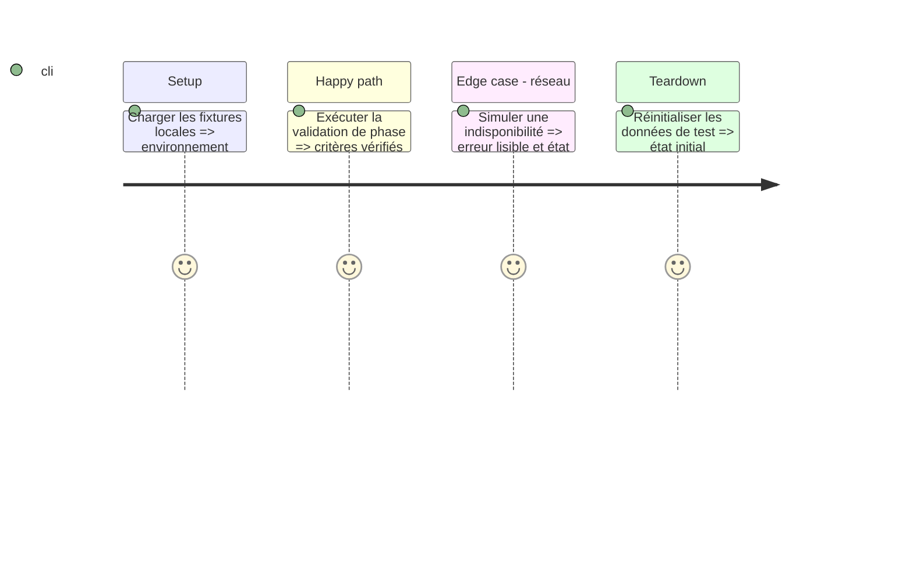

# Instruction: Compilation, tests et livraison

## Architecture projection

Créer les fichiers suivants. Aucun fichier existant à modifier ou supprimer.

```txt
Infometrie.xcodeproj/ — projet et schémas
Package.swift — tests du cœur
Tests/ — cas métier et réseau simulé
InfometrieUITests/ — parcours du simulateur
scripts/ — validation
README.md — instructions et limites
```

## User Journey

Ouvrir le projet → Compiler → Exécuter

## Test Scope



## Tasks to do

### `1)` Compiler pour le simulateur iOS 27.

### `2)` Exécuter les tests pertinents de décodage, filtre, API et playlist.

### `3)` Vérifier les écrans et parcours sur le simulateur disponible.

### `4)` Documenter le lancement et ce qui reste à vérifier avec un compte réel.

## Test acceptance criteria

| Task | Acceptance criteria |
| --- | --- |
| 1 | La compilation iOS aboutit sans erreur. |
| 2 | Les tests automatisés du cœur passent. |
| 3 | Les validations réalisées sont consignées et les limites de validation sont explicites. |
