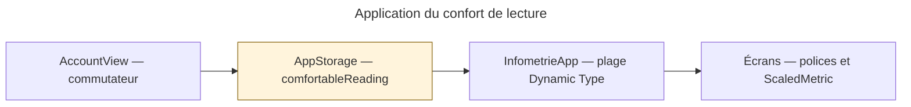

# Diagnostic — confort de lecture

Symptôme : activer « Texte plus grand » dans Compte ne produit pas l’agrandissement attendu.

1. Pourquoi la lecture ne change-t-elle pas ? Vérifier l’état du commutateur puis la taille réelle du texte.
2. Pourquoi la taille resterait-elle identique ? Le choix pourrait ne pas être enregistré ou ne pas actualiser la plage Dynamic Type.
3. Pourquoi certains textes échapperaient-ils au réglage ? Des polices fixes ou une taille système déjà supérieure au minimum peuvent l’expliquer.

| Hypothèse | Confiance finale | Validation |
| --- | --- | --- |
| Le choix n’est pas transmis ou enregistré | 1/10 | Invalidée : préférence lue à true après activation ; XCTest vérifie la conservation après relance |
| Le changement de la plage Dynamic Type à la racine ne se propage pas | 1/10 | Invalidée : avec une taille système large, les titres de Compte et de fiche grandissent immédiatement ; désactiver rétablit leurs dimensions initiales |
| La taille système dépasse déjà le minimum xLarge | 10/10 | Validée : `simctl ui <iPhone> content_size` renvoie `extra-large`. Les deux positions du commutateur donnent donc xLarge sur cet appareil |

- [x] Vérifier la persistance de la préférence.
- [x] Mesurer la propagation à Compte et aux fiches, ainsi que le retour à la taille normale.
- [x] Vérifier les styles de texte et la borne de taille : polices sémantiques/ScaledMetric, plage sans limite supérieure, taille système extra-large conservée.

## Conclusion

Le réglage fonctionne. L’absence d’effet visible vient de la taille système déjà fixée à extra-large, égale au minimum imposé lorsque le confort est activé. La modification du code applicatif n’est donc pas nécessaire pour corriger un branchement. Un retour explicite dans le réglage pourrait mieux expliquer ce cas.

Test de régression `testReadingComfortUpdatesTextImmediatelyAndPersists` passé sur iPhone 17 Pro, iOS 26.4, sans modification du code applicatif. Rapport local : `build/ReadingComfortBefore.xcresult`. Le test utilise une taille système large uniquement dans le processus de test et remet la préférence de lecture à son état initial.

Outils : lecture du code, contrôle natif du simulateur, XCTest UI, préférence ciblée via simctl, documentation Apple de `dynamicTypeSize`.

Source : [Apple — plage Dynamic Type](https://developer.apple.com/documentation/swiftui/view/dynamictypesize(_:)-26aj0).
