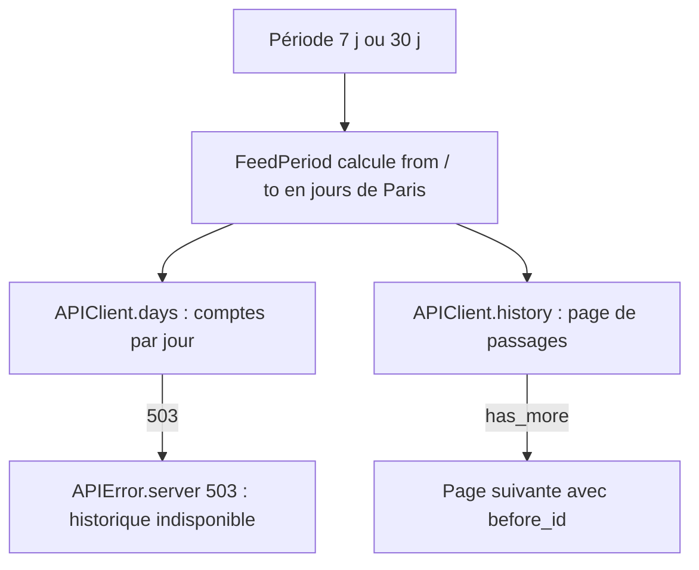
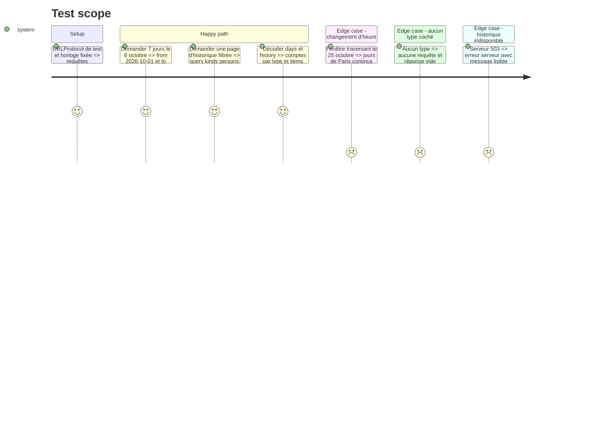

# Instruction: Contrat historique dans Core

## Architecture projection

> Tree of the final files. ✅ create · ✏️ modify · ❌ delete

```txt
.
├── Infometrie/Core/
│   ├── APIClient.swift            ✏️ requêtes history et days, message 503
│   ├── Models.swift               ✏️ HistoryResponse, DayCount, DaysResponse
│   └── FeedPeriod.swift           ✅ périodes Live / 7 j / 30 j et fenêtre en jours de Paris
└── Tests/InfometrieCoreTests/
    ├── SwaggerContractTests.swift ✏️ paramètres et décodage des deux routes
    └── FeedPeriodTests.swift      ✅ fenêtres, fuseau de Paris, changement d’heure
```

## User Journey



## Test Scope



## Tasks to do

### `1)` Périodes et fenêtres

> Une seule source de vérité pour les jours couverts par 7 j et 30 j.

1. Créer `FeedPeriod` (`live`, `week` = 7, `month` = 30) avec un libellé et un nombre de jours.
2. Calculer la liste des jours de Paris (`Europe/Paris`, `YYYY-MM-DD`) de J-N à J-1 pour une date donnée, injectable pour les tests.
3. Rester Foundation-only (Core compile dans le paquet macOS).

### `2)` Modèles

> Décoder les deux réponses avec la même tolérance que le reste de l’API.

1. `HistoryResponse` : `items: [FeedItem]`, `hasMore` (`has_more`), valeurs par défaut si absentes.
2. `DayCount` : `day`, `interventions`, `citations`, `tweets`, `interventionSec`, et le total des types cochés d’un `SearchFilters`.
3. `DaysResponse` : `days: [DayCount]`.

### `3)` Client API

> Deux routes, mêmes filtres que le fil.

1. `history(token:filters:from:to:beforeID:limit:)` : `from` / `to` en jours de Paris, `kinds`, `persons`, `parties` triés comme `feedRequest`, `limit` 50.
2. `days(token:filters:count:)` : `days`, `persons`, `parties` (pas de `kinds` : la route n’en a pas).
3. Sans type coché, `history` ne fait aucune requête, comme `feed`.
4. 503 : message « L’historique est momentanément indisponible. Réessayez. » sans casser le mapping existant des autres codes.

### `4)` Tests Core

> Le contrat est vérifié sans réseau.

1. `SwaggerContractTests` : route, Bearer, chaque paramètre, absence de `kinds` sur `/days`, décodage avec champs manquants.
2. `FeedPeriodTests` : 7 et 30 jours au 8 octobre, minuit de Paris contre UTC, semaine du 25 octobre 2026 (passage à l’heure d’hiver).

## Test acceptance criteria

| Task | Acceptance criteria |
| ---- | ------------------- |
| 1 | Le 8 octobre 2026 à 00:30 heure de Paris, 7 j couvre du 1er au 7 octobre et 30 j du 8 septembre au 7 octobre. |
| 2 | Une réponse sans `has_more` ou sans un des comptes se décode avec des valeurs par défaut. |
| 3 | Les requêtes envoyées portent exactement les paramètres du Swagger 0.11.0 et le Bearer ; un 503 donne un message d’historique indisponible. |
| 4 | `swift test` passe, nouveaux tests compris. |
