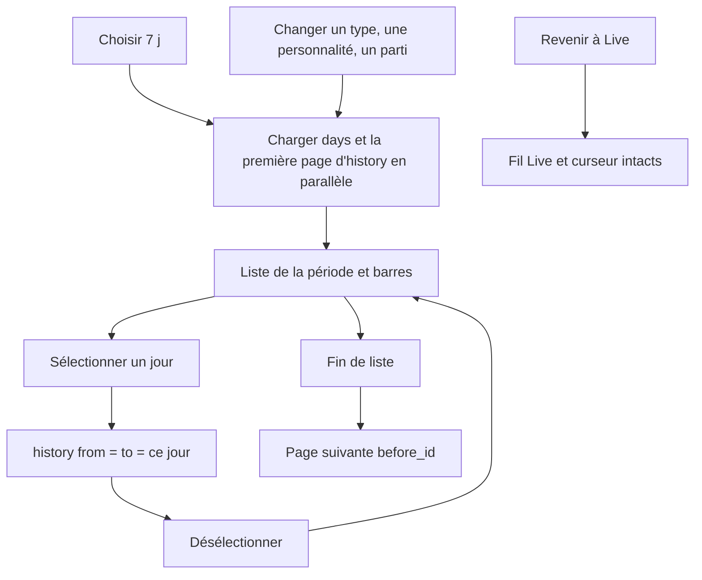
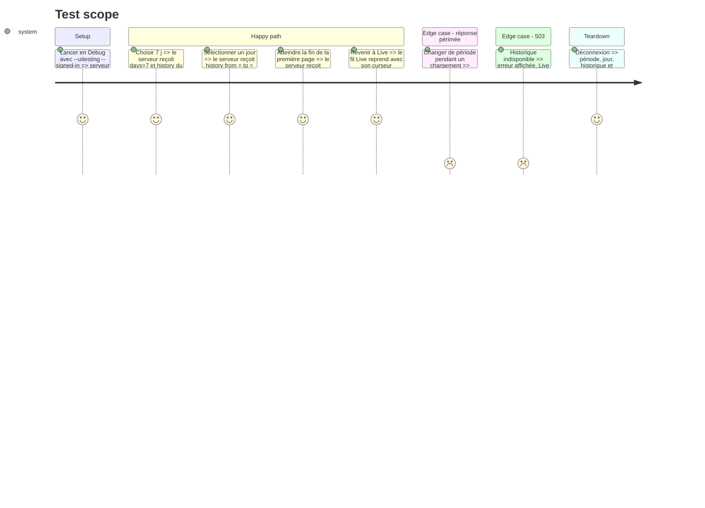

# Instruction: État du journal par période et serveur de test

## Architecture projection

> Tree of the final files. ✅ create · ✏️ modify · ❌ delete

```txt
.
├── Infometrie/Services/
│   └── AppModel.swift               ✏️ période, historique paginé, comptes par jour, jour sélectionné
├── Infometrie/InfometrieApp.swift   ✏️ la boucle de 30 s ne rafraîchit que Live
└── Infometrie/Fixtures/
    ├── FixtureContent.swift         ✏️ passages fictifs datés des jours passés, comptes par jour
    └── UITestServer.swift           ✏️ routes /history et /days, séquences de l’historique
```

## User Journey



## Test Scope



## Tasks to do

### `1)` État par période dans AppModel

> L’historique vit à côté du fil Live, sans jamais toucher son curseur.

1. Ajouter `period`, `selectedDay`, `historyItems`, `historyHasMore`, `dayCounts`, et un `requestID` propre à l’historique.
2. `visibleItems` lit `items` en Live et `historyItems` sinon, toujours à travers `filters.accepts`.
3. `selectPeriod(_:)` et `selectDay(_:)` rechargent ; un changement de filtres recharge la période courante.
4. Charger `/days` et la première page de `/history` en parallèle ; `loadMoreHistory()` ajoute la page suivante sans doublon d’`id`.
5. Une réponse d’une ancienne requête ne remplace jamais la sélection courante.
6. Erreurs : 401 / 403 terminent la session, 503 et le reste remplissent `feedError`.
7. `resetContent()` remet la période à Live et vide l’historique.

### `2)` Rafraîchissement

> Le polling ne concerne que Live.

1. La boucle de 30 s de `RootView` ne fait rien hors Live.
2. Le tirer pour rafraîchir recharge la période courante (comptes et première page).
3. Au retour au premier plan après minuit, une période 7 j / 30 j recalcule sa fenêtre.

### `3)` Serveur de test

> Les UI tests couvrent les périodes sans réseau.

1. `FixtureContent` : des passages fictifs datés de J-1 à J-30 (plus d’une page pour J-7 à J-1 avec `limit` réduit si besoin), `seq` 0, et les comptes par jour cohérents.
2. `UITestServer` : `/rest/v1/history` (filtres `from`, `to`, `kinds`, `before_id`, `limit`, 422 sans `kinds`) et `/rest/v1/days`.
3. Les passages de l’historique s’ouvrent (détail, média, timings) comme ceux du fil.
4. Rester sous `#if DEBUG`.

## Test acceptance criteria

| Task | Acceptance criteria |
| ---- | ------------------- |
| 1 | En 7 j, la liste montre les passages des 7 jours complets ; un jour sélectionné ne montre que ce jour ; revenir à Live retrouve le fil sans rechargement depuis zéro. |
| 1 | Changer de période vite plusieurs fois laisse la liste de la dernière période choisie. |
| 2 | En 7 j, aucune requête `/feed` ni `/history` ne part toutes les 30 secondes. |
| 3 | Le serveur de test répond aux deux routes et un passage de l’historique s’ouvre et se lit. |
