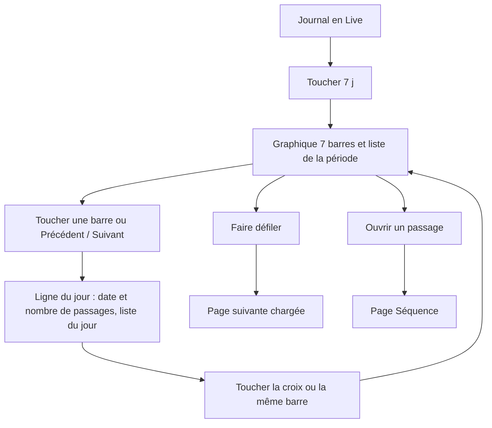
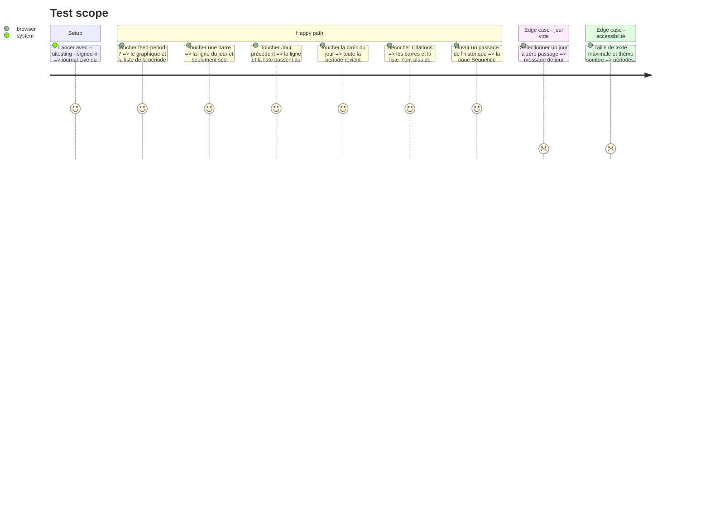

# Instruction: Sélecteur de période, graphique et liste

## Architecture projection

> Tree of the final files. ✅ create · ✏️ modify · ❌ delete

```txt
.
├── Infometrie/Views/
│   ├── FeedView.swift          ✏️ périodes actives, choix Liste / Graphique retiré, défilement infini, états vides
│   └── DayChart.swift          ✅ barres empilées par jour, sélection, ligne du jour choisi
├── InfometrieUITests/
│   └── InfometrieUITests.swift ✏️ testFeedPeriodsChartSelectsDay
└── aidd_docs/memory/
    ├── design.md               ✏️ graphique, sélection du jour, fin de « Bientôt disponible »
    ├── project-brief.md        ✏️ périodes livrées, synthèse par personne / parti toujours en attente
    └── testing.md              ✏️ nouveau test dans « UI tests by area »
```

## User Journey



## Test Scope



## Wireframe

```txt
┌───────────────────────────────────────┐
│ (1) infométrie            Rechercher  │
├───────────────────────────────────────┤
│ (2) ■ Interventions ■ Citations ■ X   │  épinglé
├───────────────────────────────────────┤
│ (3) Live   7 j   [30 j]               │
│ (4) ▁▂▁▃▂▁▁▂▅▄▄▆█▇▃▂▄▂▃▃▁▁▁▂▂▁▁▂▁▂    │
│     08/09     15/09     22/09   hier  │
│ (5)  ‹   Mer. 24/09 · 42 passages  › ✕│
├───────────────────────────────────────┤
│ (6) 42 résultats       ▶ Tout écouter │
│ (7) ┃ INTERVENTION            [logo]  │
│     ┃ Personne · Parti                │
│     ┃ Titre du passage                │
│     ┃ ...                             │
│ (8) chargement de la page suivante    │
└───────────────────────────────────────┘
```

1. Barre de navigation inchangée.
2. Cases de types inchangées, toujours épinglées ; elles pilotent aussi les barres.
3. Onglets de période, tous actifs ; plus de choix Liste / Graphique.
4. Graphique, en 7 j et 30 j seulement : une barre par jour complet, types cochés empilés, barre choisie mise en avant.
5. Ligne du jour, seulement quand un jour est choisi : jour précédent, date et total, jour suivant, retour à la période.
6. Ligne d’état : total de la période ou du jour, « Tout écouter » sur les passages chargés.
7. Cartes de passage inchangées.
8. Squelette en fin de liste pendant le chargement d’une page.

## Tasks to do

### `1)` Onglets de période

> Live, 7 j et 30 j fonctionnent ; le choix d’affichage disparaît.

1. Brancher les trois onglets sur `model.selectPeriod`, retirer l’alerte « Bientôt disponible » et les deux onglets d’affichage.
2. Garder les identifiants `feed-period-live`, `feed-period-7`, `feed-period-30`, valeur VoiceOver « Sélectionné ».
3. Changer de période remonte en haut sans animation, comme un changement de critères.

### `2)` Graphique par jour

> L’histogramme de la capture, aux couleurs de marque.

1. `DayChart` avec Swift Charts : `BarMark` empilées par type coché, `FeedItem.color(ofKind:)`, axe des jours en `dd/MM` avec « hier » au bout, sans grille lourde.
2. Tap sur une barre (`chartGesture` + `ChartProxy.value(atX:)`) : sélectionne le jour, ou le désélectionne s’il l’est déjà ; les autres barres s’estompent.
3. Hauteur fixe en points, qui grandit modérément avec la taille de texte ; squelette pendant le chargement des comptes.
4. VoiceOver : un élément par jour, « mercredi 24 septembre, 2 interventions, 40 citations », action pour sélectionner ; identifiant `feed-day-chart`.

### `3)` Ligne du jour sélectionné

> Choisir un jour sans viser une barre de 9 pt.

1. Boutons jour précédent / suivant de 44 pt minimum, désactivés aux bords de la période.
2. Date longue et total des types cochés ; croix pour revenir à toute la période.
3. Identifiants `feed-day-selection`, `feed-day-previous`, `feed-day-next`, `feed-day-clear` ; passage en colonne aux tailles d’accessibilité.

### `4)` Liste et états

> La liste suit la période et le jour.

1. Défilement infini : la dernière carte visible déclenche `loadMoreHistory()` ; squelette en fin de liste.
2. `FeedStatus` : total des comptes de `/days` pour la période ou le jour en 7 j / 30 j ; l’âge du dernier rafraîchissement en Live seulement.
3. États vides propres à chaque cas : Live (texte actuel), période vide, jour vide.
4. « Tout écouter » prend les passages lisibles chargés de la période ou du jour.

### `5)` Tests et mémoire

> Le parcours est couvert et la mémoire dit vrai.

1. `testFeedPeriodsChartSelectsDay` couvre le parcours du Test Scope.
2. Mettre à jour `design.md`, `project-brief.md`, `testing.md` (tableau par zone).
3. Montrer l’app à l’utilisateur dans le simulateur, avec le vrai compte.

## Test acceptance criteria

| Task | Acceptance criteria |
| ---- | ------------------- |
| 1 | Toucher 7 j ou 30 j change la liste sans alerte ; aucun bouton Liste / Graphique n’est visible. |
| 2 | En 7 j, 7 barres ; en 30 j, 30 barres ; décocher un type le retire des barres ; la barre touchée est mise en avant. |
| 3 | Précédent / Suivant changent de jour et s’arrêtent aux bords ; la croix rend toute la période. |
| 4 | Faire défiler une période de plus de 50 passages charge la suite sans doublon ; un jour vide l’annonce. |
| 5 | Le nouveau test passe sur iPhone 17 Pro iOS 26.4 ; l’écran est lisible en sombre et à la plus grande taille de texte sur iPhone 13 mini. |
